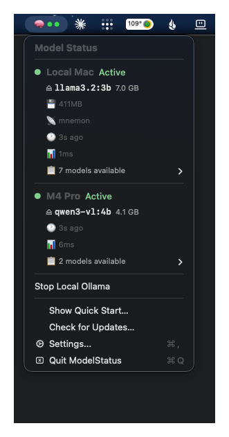

# ModelStatus

[](https://github.com/lucasmullikin/ModelStatus/actions/workflows/build.yml)
[](https://github.com/lucasmullikin/ModelStatus/releases/latest)
[](https://github.com/lucasmullikin/ModelStatus/releases)
[](LICENSE)
[](https://www.apple.com/macos/)
[](https://swift.org)

A macOS menu bar app for monitoring local AI model servers — **Ollama**, **LM Studio**, **vLLM**, **llama.cpp**, **MLX**, and anything else that speaks the OpenAI-compatible HTTP API. Free, MIT, no telemetry.

```bash
brew tap lucasmullikin/tap && brew install --cask modelstatus
```

<p align="center">
  
</p>

## Why

Most menu bar tools show one status dot for one server. ModelStatus monitors **multiple servers in parallel** — your laptop's Ollama, your Mac mini's MLX, a remote vLLM box behind Tailscale — and surfaces what's loaded, how much VRAM is in use, who's hitting it, and whether something is generating right now.

## Features

- **Multi-provider, auto-detected.** Add a URL, the app probes it and picks the right backend (Ollama / LM Studio / vLLM / generic OpenAI-compat).
- **Per-model VRAM bar** rendered against your system's unified memory (Ollama + vLLM).
- **Eject loaded models** from the menu — `keep_alive: 0` on Ollama, `/api/v0/models/unload` on LM Studio.
- **Load models into memory** from the menu — Ollama + LM Studio.
- **Authorization headers** for remote Ollama/MLX/etc. behind a tunnel — stored in macOS Keychain, never in the JSON config.
- **Reachability notifications** (opt-in) when a server drops or comes back.
- **Network discovery** — Settings → Discover scans your local /24 and Tailscale peers for known model-server ports.
- **Compact mode** — one-line-per-server menu when you have many instances.
- **Local Ollama process control** — Start/Stop, works with both Homebrew and the official `.dmg` install.
- **Start at login** — Settings → "Start ModelStatus at login" checkbox (SMAppService). Legacy LaunchAgent also included for Homebrew/direct installs.
- **No telemetry, no analytics, no cloud.**

## Supported providers

| Provider | Auto-detected via | Eject | Load | VRAM | Notes |
|---|---|---|---|---|---|
| **Ollama** | `/api/tags` | ✅ `keep_alive: 0` | ✅ `keep_alive: -1` | ✅ `/api/ps size_vram` | First-class. Generating-state detection. |
| **LM Studio** | `/api/v0/models` | ✅ `/api/v0/models/unload` | ✅ `/api/v0/models/load` | — | Multi-model load supported. |
| **vLLM** | `/metrics` (Prometheus) | — | — | ✅ from `/metrics` | OpenAI-compat + Prometheus. |
| **OpenAI-compatible** (llama.cpp, MLX, LocalAI, Text-Gen-WebUI, …) | `/v1/models` | — | — | — | Catch-all. Anything OpenAI-shaped works. |

## Requirements

- macOS 13 (Ventura) or later
- At least one of the supported model servers, running locally or reachable on your network

## Install

### Option A — Homebrew Cask (recommended)

```bash
brew tap lucasmullikin/tap
brew install --cask modelstatus
```

The binary is currently **unsigned**. Run once after install:

```bash
xattr -dr com.apple.quarantine /Applications/ModelStatus.app
```

Then `open /Applications/ModelStatus.app`. The 🧠 icon appears in the menu bar.

### Option B — GitHub Release

1. Download `ModelStatus-v0.2.0.zip` from [Releases](https://github.com/lucasmullikin/ModelStatus/releases)
2. Unzip, drag `ModelStatus.app` to `/Applications`
3. `xattr -dr com.apple.quarantine /Applications/ModelStatus.app`
4. Open it

### Option C — Build from source

```bash
git clone https://github.com/lucasmullikin/ModelStatus.git
cd ModelStatus
./scripts/build-app.sh
open build/ModelStatus.app
```

### Start at login

Open **Settings** in the app and check **"Start ModelStatus at login"**. This uses `SMAppService` (macOS 13+) and requires no manual steps.

#### Legacy: LaunchAgent (Homebrew / direct installs, pre-v1.0)

> Note: the LaunchAgent method is superseded by the SMAppService checkbox in v1.0+. Use it only if you need start-at-login on a build that predates the Settings checkbox.

```bash
cp LaunchAgent/com.lucasmullikin.ModelStatus.plist ~/Library/LaunchAgents/
launchctl bootstrap gui/$UID ~/Library/LaunchAgents/com.lucasmullikin.ModelStatus.plist
```

(The bundled LaunchAgent expects the app at `/Applications/ModelStatus.app`. Edit it if you installed elsewhere.)

## First-run

When the app launches it polls `http://127.0.0.1:11434` (Ollama default) by default. To add more:

- **Settings → Discover…** to scan your LAN + Tailscale for known servers
- **Settings → Add** for manual entry (Kind = Auto lets the app probe)

For remote tunneled instances that need an auth header, select the row and click **Edit Auth…**. The header value goes straight into the macOS Keychain.

## Status legend

| Icon | Meaning |
|------|---------|
| 🟢 ●  | Active — server reachable, models loaded |
| 🔵 ●  | Generating — inference in flight (Ollama only) |
| 🟡 ○  | Idle — reachable, no models loaded |
| 🔴 ✗  | Unreachable — server is down or the URL is wrong |
| ⚪ ?  | Checking — first poll hasn't completed |

The blue "Generating" dot is **only** shown for Ollama, which exposes inference state. Other providers don't, so we don't lie — they stay green Active even during generation.

## Configuration

File: `~/Library/Preferences/com.lucasmullikin.ModelStatus.json` (mode 0600)

```json
{
  "instances": [
    { "id": "...", "name": "Local", "url": "http://127.0.0.1:11434", "kind": "ollama" }
  ],
  "pollInterval": 5.0,
  "notifyOnStateChange": false,
  "compactMode": false
}
```

`kind` values: `auto`, `ollama`, `openAI`, `lmStudio`, `vllm`. `auto` makes the app probe the URL and pick the right provider.

Edit through the Settings window or by hand-editing the JSON while the app is closed.

## Security notes

- **URLs validated** — only `http://` and `https://`. Cloud metadata endpoints (`169.254.169.254`, `metadata.google.internal`, etc.) are blocked.
- **Response size cap** — 4 MB per `/api/ps` and `/api/tags` response to prevent memory amplification from a malicious endpoint.
- **App Transport Security** — `NSAllowsLocalNetworking=true` permits plain `http://` to loopback and `.local` hosts. For remote, prefer HTTPS through a reverse proxy.
- **Sandbox is OFF.** The app uses `lsof` / `ps` / `pgrep` for local-server telemetry (active model, client process, CPU/RAM). These tools aren't available inside the macOS App Sandbox. This is an intentional trade-off. The future Mac App Store build will inject a sandboxed `LocalSystemAccess` provider that returns nil for these probes — polling will keep working (HTTP-only), but client-process display, CPU/RSS, and Tailscale discovery will degrade gracefully to "unavailable."
- **Auth headers** are stored only in the Keychain with `kSecAttrAccessibleAfterFirstUnlockThisDeviceOnly`. No iCloud sync.
- **No analytics, no telemetry.** Only outbound traffic is to the servers you configure.

## Privacy

ModelStatus does not phone home. It does not collect telemetry, crash reports, usage metrics, or anything else. The only outbound network traffic is to the model servers in your config. The Discover scan is **on-demand only** — you click it; it never runs automatically.

## Architecture

See [`DESIGN.md`](DESIGN.md) for the full design doc. The short version:

```
StatusIndicator → AppDelegate → Monitor (actor) → [Ollama|LMStudio|vLLM|OpenAI]Provider → URLSession
                                       ↓
                       ConfigManager · Keychain · Discovery
```

Each provider implements the same `Provider` protocol and declares capability flags (`canEject`, `canLoadModel`, `reportsVRAM`, `reportsGenerating`). The UI inspects those flags to decide what actions to show for each instance.

## Building

```bash
swift build -c release           # build
swift test                       # tests (needs full Xcode, not just CLT)
./scripts/build-app.sh           # assemble .app bundle in build/
```

To codesign for distribution (requires Apple Developer ID):

```bash
./scripts/build-app.sh --sign "Developer ID Application: Your Name (TEAMID)"
```

See [`CONTRIBUTING.md`](CONTRIBUTING.md) for project layout and code style.

## Roadmap

See [`RELEASE-PLAN.md`](RELEASE-PLAN.md) for the full plan. Highlights:

- **Shipped in v0.2** ([details](RELEASE-PLAN.md#v02-summary)): dedicated MLXProvider, OSLog viewer + diagnostic bundle export, salted-hash log scrubber, UpdateChecker snooze/dismiss, @MainActor ConfigManager, `LocalSystemAccess` abstraction, 50+ rounds of security/correctness hardening
- **Shipped in v0.2.1**: bundle-ID rename to `com.lucasmullikin.ModelStatus`, logging audit, LogViewer fix, Anonymizer IPv6 fixes, MLXProvider sandbox fallback, 4 architectural refactors
- **Next (v1.0)**: Mac App Store release — $6.99 one-time, sandboxed build, SMAppService start-at-login, free updates forever
- **Eventually**: Linux/Windows builds

Specific version labels and dates aren't promised. See [RELEASE-PLAN.md](RELEASE-PLAN.md) for the current scope of work in flight.

## License

[MIT](LICENSE) — Copyright © 2026 Lucas Mullikin.

Source is and always will be free. A future paid Mac App Store build is planned to fund development. Build-from-source will remain free forever.
